# vue com pinia

O Pinia é o gerenciador de estado do Vue3. Ele é um gerenciador de estado leve e fácil de usar que pode ser usado para compartilhar estados reativos em toda a sua aplicação Vue.

Para ilustrar melhor, vamos a um exemplo. Suponha que você esteja criando uma aplicação Vue que precisa de um modal. Uma solução seria criar um componente modal que seria adicionado a todos os componentes que precisam do modal.

No entanto, essa solução não seria a ideal. Isso porque uma página pode conter vários componentes que precisam do modal, o que implicaria em adicionar o modal a vários outros componentes. Isso pode se tornar um problema se a sua aplicação escalar.

Para solucionar o problema, você pode ter um único modal adicionado ao "App.vue", que é o componente raiz do projeto. Você pode passar para todos os componentes uma propriedade chamada activeModal, que poderia ser uma string que identifica qual modal está ativo no momento. Os componentes filhos emitiriam o evento com a string para definir qual modal ficará ativo.

No entanto, essa solução ainda não é ideal, pois para projetos mais complexos é comum que haja vários níveis de componentes, como filho (nível 1), neto (nível 2), bisneto (nível 3), etc. Nesses casos, ocorreria a necessidade de emitir o evento com a minha prop até o componente raiz.

Você pode utilizar um gerenciador de estado, para que os componentes que precisem modificar os estados do modal, setem o valor diretamente pelo Pinia, tratando diretamente no App.vue, que é o componente raiz do projeto. Utilizando gerenciador de estado, o código fica mais claro e mais fácil de manter.

Para esse caso, você pode criar um gerenciador de modais modalHandle, que será um componente Vue responsável por gerenciar qual modal está ativo no momento. Por padrão, o valor null representará que não existe nenhum modal ativo no momento.

### Instalçao pinia
instalando pinia, se vc utilizar o comando ```sh npm create vue@3```, na instalação do projeto vue vc pode escolher utilizar o pinia, instalações padrões do vue não instalam pinia por padrão comando para instalação ```sh npm install pinia```
